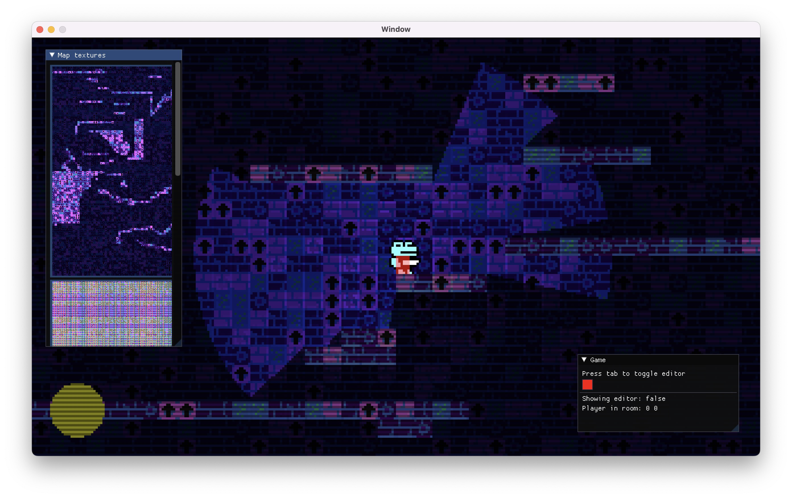
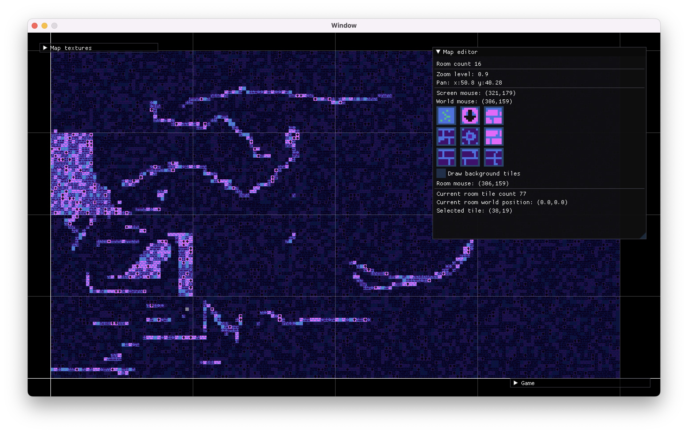

# Learning Rust by creating a simple game engine

- Highly influcened by:

* https://github.com/noelfb/blah
* https://www.youtube.com/watch?v=JxIZbV_XjAs
* https://learnopengl.com/Introduction

# Dependencies

- SDL (windowing + event handling)
- OpenGL -> will probably replace this with SLD3_GPU soon
- ~Bevy (ECS only)~ built my own ECS

