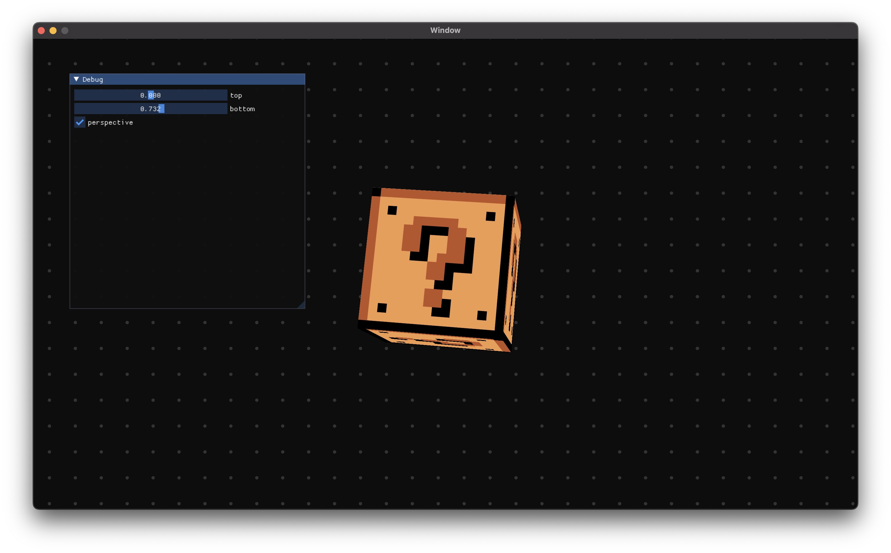
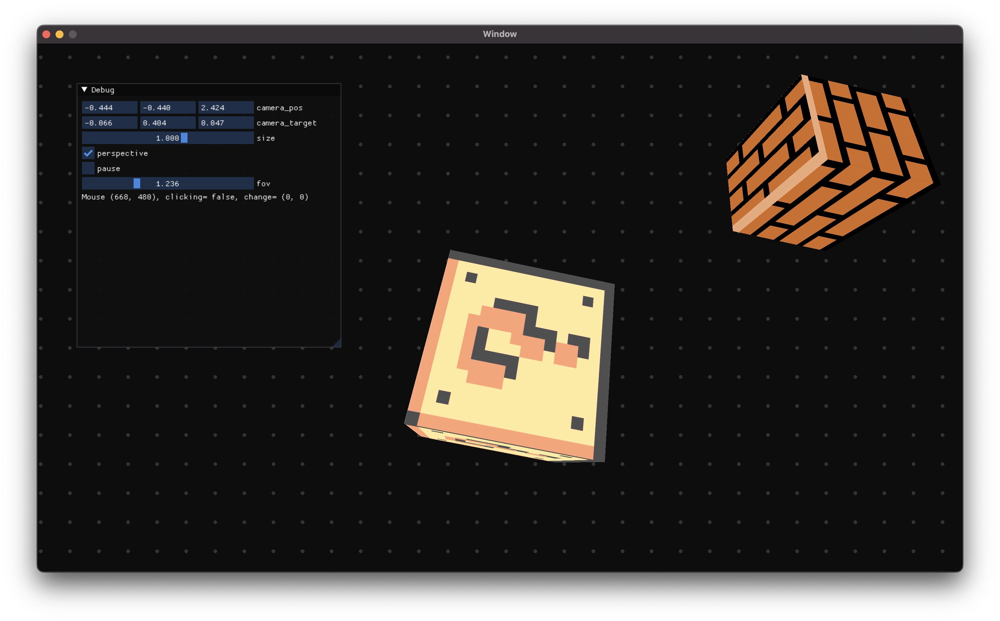

# Learning Rust by creating a simple game engine

- Highly influcened by:

* https://github.com/noelfb/blah
* https://www.youtube.com/watch?v=JxIZbV_XjAs
* https://learnopengl.com

# Dependencies

- SDL (windowing + event handling)
- OpenGL

